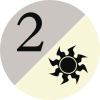

```{r, include = FALSE}
knitr::opts_chunk$set(collapse = TRUE, comment = "#>")
library(scryr)
```

While Magic cards can represent costs and colors using printed symbols, the
[Comprehensive Rules](https://magic.wizards.com/en/rules) and Scryfall's API use
a text representation of these values.

## Color Vectors

Whenever the API presents set of _Magic_ colors, the column will be a vector
that uses the uppercase, single-character abbreviations for those colors. For
example, `<"W", "U">` represents something that is both white and blue.
Colorless sources are denoted with an empty vector `NULL`.

Common places were you might see this kind of vector are `scry_cards()`'s
`colors` and `color_identity`. When a color column is `NULL` or `NA`, it implies
that that information is not pertinent for the current object. It does not imply
that the object is colorless.

Color vectors are **not guaranteed to be in a particular order**.

A list of color representations is provided below:

| Abbr. | Color | Basic Land | Mana Symbol                                                 |
| ----- | ----- | ---------- | ----------------------------------------------------------- |
| [`W`](https://scryfall.com/search?order=edhrec&q=o%3A%22%7BW%7D%22+OR+m%3A%7BW%7D) | White | Plains     |  |
| [`U`](https://scryfall.com/search?order=edhrec&q=o%3A%22%7BU%7D%22+OR+m%3A%7BU%7D) | Blue  | Island     |  |
| [`B`](https://scryfall.com/search?order=edhrec&q=o%3A%22%7BB%7D%22+OR+m%3A%7BB%7D) | Black | Swamp      |  |
| [`R`](https://scryfall.com/search?order=edhrec&q=o%3A%22%7BR%7D%22+OR+m%3A%7BR%7D) | Red   | Mountain   |  |
| [`G`](https://scryfall.com/search?order=edhrec&q=o%3A%22%7BG%7D%22+OR+m%3A%7BG%7D) | Green | Forest     |  |

## Mana Costs and Other Symbology

Whenever the API presents mana costs and other card symbols, it does so using
the official plaintext notation for that symbol set forth in the
[Comprehensive Rules](https://magic.wizards.com/en/rules). For example,
",
" is
written as `{2/W}, {T}`.

An exhaustive list of all symbology is provided below. You can also retrieve
this information programmatically using the `scry_symbols()` function.

Note that some symbols use UTF-8 characters outside the ASCII range.

| Symbol        | Printed                                                            | Description                        |
| ------------- | ------------------------------------------------------------------ | ---------------------------------- |
| [`{T}`](https://scryfall.com/search?order=edhrec&q=o%3A%22%7BT%7D%22)                                        |         | Tap this permanent                 |
| [`{Q}`](https://scryfall.com/search?order=edhrec&q=o%3A%22%7BQ%7D%22)                                        |         | Untap this permanent               |
| [`{E}`](https://scryfall.com/search?order=edhrec&q=o%3A%22%7BE%7D%22)                                        |         | An energy counter                  |
| [`{PW}`](https://scryfall.com/search?order=edhrec&q=o%3A%22%7BPW%7D%22)                                      |        | Planeswalker                       |
| [`{CHAOS}`](https://scryfall.com/search?order=edhrec&q=o%3A%22%7BCHAOS%7D%22)                                |     | Chaos                              |
| [`{A}`](https://scryfall.com/search?order=edhrec&q=o%3A%22%7BA%7D%22)                                        |         | An acorn counter                   |
| [`{X}`](https://scryfall.com/search?order=edhrec&q=m%3A%22%7BX%7D%22+OR+o%3A%22%7BX%7D%22)                   |         | X generic mana                     |
| [`{Y}`](https://scryfall.com/search?order=edhrec&q=m%3A%22%7BY%7D%22+OR+o%3A%22%7BY%7D%22)                   |         | Y generic mana                     |
| [`{Z}`](https://scryfall.com/search?order=edhrec&q=m%3A%22%7BZ%7D%22+OR+o%3A%22%7BZ%7D%22)                   |         | Z generic mana                     |
| [`{0}`](https://scryfall.com/search?order=edhrec&q=m%3A%22%7B0%7D%22+OR+o%3A%22%7B0%7D%22)                   |         | Zero mana                          |
| [`{½}`](https://scryfall.com/search?order=edhrec&q=m%3A%22%7B%C2%BD%7D%22+OR+o%3A%22%7B%C2%BD%7D%22)         |      | One-half generic mana              |
| [`{1}`](https://scryfall.com/search?order=edhrec&q=m%3A%22%7B1%7D%22+OR+o%3A%22%7B1%7D%22)                   |         | One generic mana                   |
| [`{2}`](https://scryfall.com/search?order=edhrec&q=m%3A%22%7B2%7D%22+OR+o%3A%22%7B2%7D%22)                   |         | Two generic mana                   |
| [`{3}`](https://scryfall.com/search?order=edhrec&q=m%3A%22%7B3%7D%22+OR+o%3A%22%7B3%7D%22)                   |         | Three generic mana                 |
| [`{4}`](https://scryfall.com/search?order=edhrec&q=m%3A%22%7B4%7D%22+OR+o%3A%22%7B4%7D%22)                   |         | Four generic mana                  |
| [`{5}`](https://scryfall.com/search?order=edhrec&q=m%3A%22%7B5%7D%22+OR+o%3A%22%7B5%7D%22)                   |         | Five generic mana                  |
| [`{6}`](https://scryfall.com/search?order=edhrec&q=m%3A%22%7B6%7D%22+OR+o%3A%22%7B6%7D%22)                   |         | Six generic mana                   |
| [`{7}`](https://scryfall.com/search?order=edhrec&q=m%3A%22%7B7%7D%22+OR+o%3A%22%7B7%7D%22)                   |         | Seven generic mana                 |
| [`{8}`](https://scryfall.com/search?order=edhrec&q=m%3A%22%7B8%7D%22+OR+o%3A%22%7B8%7D%22)                   |         | Eight generic mana                 |
| [`{9}`](https://scryfall.com/search?order=edhrec&q=m%3A%22%7B9%7D%22+OR+o%3A%22%7B9%7D%22)                   |         | Nine generic mana                  |
| [`{10}`](https://scryfall.com/search?order=edhrec&q=m%3A%22%7B10%7D%22+OR+o%3A%22%7B10%7D%22)                |        | Ten generic mana                   |
| [`{11}`](https://scryfall.com/search?order=edhrec&q=m%3A%22%7B11%7D%22+OR+o%3A%22%7B11%7D%22)                |        | Eleven generic mana                |
| [`{12}`](https://scryfall.com/search?order=edhrec&q=m%3A%22%7B12%7D%22+OR+o%3A%22%7B12%7D%22)                |        | Twelve generic mana                |
| [`{13}`](https://scryfall.com/search?order=edhrec&q=m%3A%22%7B13%7D%22+OR+o%3A%22%7B13%7D%22)                |        | Thirteen generic mana              |
| [`{14}`](https://scryfall.com/search?order=edhrec&q=m%3A%22%7B14%7D%22+OR+o%3A%22%7B14%7D%22)                |        | Fourteen generic mana              |
| [`{15}`](https://scryfall.com/search?order=edhrec&q=m%3A%22%7B15%7D%22+OR+o%3A%22%7B15%7D%22)                |        | Fifteen generic mana               |
| [`{16}`](https://scryfall.com/search?order=edhrec&q=m%3A%22%7B16%7D%22+OR+o%3A%22%7B16%7D%22)                |        | Sixteen generic mana               |
| [`{17}`](https://scryfall.com/search?order=edhrec&q=m%3A%22%7B17%7D%22+OR+o%3A%22%7B17%7D%22)                |        | Seventeen generic mana             |
| [`{18}`](https://scryfall.com/search?order=edhrec&q=m%3A%22%7B18%7D%22+OR+o%3A%22%7B18%7D%22)                |        | Eighteen generic mana              |
| [`{19}`](https://scryfall.com/search?order=edhrec&q=m%3A%22%7B19%7D%22+OR+o%3A%22%7B19%7D%22)                |        | Nineteen generic mana              |
| [`{20}`](https://scryfall.com/search?order=edhrec&q=m%3A%22%7B20%7D%22+OR+o%3A%22%7B20%7D%22)                |        | Twenty generic mana                |
| [`{100}`](https://scryfall.com/search?order=edhrec&q=m%3A%22%7B100%7D%22+OR+o%3A%22%7B100%7D%22)             |       | One hundred generic mana           |
| [`{1000000}`](https://scryfall.com/search?order=edhrec&q=m%3A%22%7B1000000%7D%22+OR+o%3A%22%7B1000000%7D%22) |   | One million generic mana           |
| [`{∞}`](https://scryfall.com/search?order=edhrec&q=m%3A%22%7B%E2%88%9E%7D%22+OR+o%3A%22%7B%E2%88%9E%7D%22)   |  | Infinite generic mana              |
| [`{W/U}`](https://scryfall.com/search?order=edhrec&q=m%3A%22%7BW%2FU%7D%22+OR+o%3A%22%7BW%2FU%7D%22)         |        | One white or blue mana             |
| [`{W/B}`](https://scryfall.com/search?order=edhrec&q=m%3A%22%7BW%2FB%7D%22+OR+o%3A%22%7BW%2FB%7D%22)         |        | One white or black mana            |
| [`{B/R}`](https://scryfall.com/search?order=edhrec&q=m%3A%22%7BB%2FR%7D%22+OR+o%3A%22%7BB%2FR%7D%22)         |        | One black or red mana              |
| [`{B/G}`](https://scryfall.com/search?order=edhrec&q=m%3A%22%7BB%2FG%7D%22+OR+o%3A%22%7BB%2FG%7D%22)         |        | One black or green mana            |
| [`{U/B}`](https://scryfall.com/search?order=edhrec&q=m%3A%22%7BU%2FB%7D%22+OR+o%3A%22%7BU%2FB%7D%22)         |        | One blue or black mana             |
| [`{U/R}`](https://scryfall.com/search?order=edhrec&q=m%3A%22%7BU%2FR%7D%22+OR+o%3A%22%7BU%2FR%7D%22)         |        | One blue or red mana               |
| [`{R/G}`](https://scryfall.com/search?order=edhrec&q=m%3A%22%7BR%2FG%7D%22+OR+o%3A%22%7BR%2FG%7D%22)         |        | One red or green mana              |
| [`{R/W}`](https://scryfall.com/search?order=edhrec&q=m%3A%22%7BR%2FW%7D%22+OR+o%3A%22%7BR%2FW%7D%22)         |        | One red or white mana              |
| [`{G/W}`](https://scryfall.com/search?order=edhrec&q=m%3A%22%7BG%2FW%7D%22+OR+o%3A%22%7BG%2FW%7D%22)         |        | One green or white mana            |
| [`{G/U}`](https://scryfall.com/search?order=edhrec&q=m%3A%22%7BG%2FU%7D%22+OR+o%3A%22%7BG%2FU%7D%22)         |        | One green or blue mana             |
| [`{2/W}`](https://scryfall.com/search?order=edhrec&q=m%3A%22%7B2%2FW%7D%22+OR+o%3A%22%7B2%2FW%7D%22)         |        | Two generic mana or one white mana |
| [`{2/U}`](https://scryfall.com/search?order=edhrec&q=m%3A%22%7B2%2FU%7D%22+OR+o%3A%22%7B2%2FU%7D%22)         |        | Two generic mana or one blue mana  |
| [`{2/B}`](https://scryfall.com/search?order=edhrec&q=m%3A%22%7B2%2FB%7D%22+OR+o%3A%22%7B2%2FB%7D%22)         |        | Two generic mana or one black mana |
| [`{2/R}`](https://scryfall.com/search?order=edhrec&q=m%3A%22%7B2%2FR%7D%22+OR+o%3A%22%7B2%2FR%7D%22)         |        | Two generic mana or one red mana   |
| [`{2/G}`](https://scryfall.com/search?order=edhrec&q=m%3A%22%7B2%2FG%7D%22+OR+o%3A%22%7B2%2FG%7D%22)         |        | Two generic mana or one green mana |
| [`{P}`](https://scryfall.com/search?order=edhrec&q=m%3A%22%7BP%7D%22+OR+o%3A%22%7BP%7D%22)                   |         | One colored mana or two life       |
| [`{W/P}`](https://scryfall.com/search?order=edhrec&q=m%3A%22%7BW%2FP%7D%22+OR+o%3A%22%7BW%2FP%7D%22)         |        | One white mana or two life         |
| [`{U/P}`](https://scryfall.com/search?order=edhrec&q=m%3A%22%7BU%2FP%7D%22+OR+o%3A%22%7BU%2FP%7D%22)         |        | One blue mana or two life          |
| [`{B/P}`](https://scryfall.com/search?order=edhrec&q=m%3A%22%7BB%2FP%7D%22+OR+o%3A%22%7BB%2FP%7D%22)         |        | One black mana or two life         |
| [`{R/P}`](https://scryfall.com/search?order=edhrec&q=m%3A%22%7BR%2FP%7D%22+OR+o%3A%22%7BR%2FP%7D%22)         |        | One red mana or two life           |
| [`{G/P}`](https://scryfall.com/search?order=edhrec&q=m%3A%22%7BG%2FP%7D%22+OR+o%3A%22%7BG%2FP%7D%22)         |        | One green mana or two life         |
| [`{HW}`](https://scryfall.com/search?order=edhrec&q=m%3A%22%7BHW%7D%22+OR+o%3A%22%7BHW%7D%22)                |        | One-half white mana                |
| [`{HR}`](https://scryfall.com/search?order=edhrec&q=m%3A%22%7BHR%7D%22+OR+o%3A%22%7BHR%7D%22)                |        | One-half red mana                  |
| [`{W}`](https://scryfall.com/search?order=edhrec&q=m%3A%22%7BW%7D%22+OR+o%3A%22%7BW%7D%22)                   |         | One white mana                     |
| [`{U}`](https://scryfall.com/search?order=edhrec&q=m%3A%22%7BU%7D%22+OR+o%3A%22%7BU%7D%22)                   |         | One blue mana                      |
| [`{B}`](https://scryfall.com/search?order=edhrec&q=m%3A%22%7BB%7D%22+OR+o%3A%22%7BB%7D%22)                   |         | One black mana                     |
| [`{R}`](https://scryfall.com/search?order=edhrec&q=m%3A%22%7BR%7D%22+OR+o%3A%22%7BR%7D%22)                   |         | One red mana                       |
| [`{G}`](https://scryfall.com/search?order=edhrec&q=m%3A%22%7BG%7D%22+OR+o%3A%22%7BG%7D%22)                   |         | One green mana                     |
| [`{C}`](https://scryfall.com/search?order=edhrec&q=m%3A%22%7BC%7D%22+OR+o%3A%22%7BC%7D%22)                   |         | One colorless mana                 |
| [`{S}`](https://scryfall.com/search?order=edhrec&q=m%3A%22%7BS%7D%22+OR+o%3A%22%7BS%7D%22)                   |         | One snow mana                      |
