```{r, include = FALSE}
knitr::opts_chunk$set(collapse = TRUE, comment = "#>")
library(scry)
```

While Magic cards can represent costs and colors using printed symbols, the
[Comprehensive Rules](http://magic.wizards.com/en/game-info/gameplay/rules-and-formats/rules)
and Scryfall's API use a text representation of these values.

## Color Arrays

Whenever the API presents set of Magic colors, the field will be an array that
uses the uppercase, single-character abbreviations for those colors. For
example, `["W","U"]` represents something that is both white and blue. Colorless
sources are denoted with an empty array `[]`.

Common places were you might see this kind of array are a Card object's `colors`
and `color_identity`. When a color field is `null` or missing, it implies that
that information is not pertinent for the current object. It does not imply that
the object is colorless.

Color arrays are not guaranteed to be in a particular order.

A list of color representations is provided below:

| Abbr. | Color | Basic Land                                                                  | Mana Symbol | Examples                                                                                     |
| ----- | ----- | --------------------------------------------------------------------------- | ----------- | -------------------------------------------------------------------------------------------- |
| `W`   | White | [Plains](https://scryfall.com/search?q=%21%22Plains%22+unique%3Aprints)     | {W}         | [Example Cards](https://scryfall.com/search?order=edhrec&q=o%3A%22%7BW%7D%22+OR+m%3A%7BW%7D) |
| `U`   | Blue  | [Island](https://scryfall.com/search?q=%21%22Island%22+unique%3Aprints)     | {U}         | [Example Cards](https://scryfall.com/search?order=edhrec&q=o%3A%22%7BU%7D%22+OR+m%3A%7BU%7D) |
| `B`   | Black | [Swamp](https://scryfall.com/search?q=%21%22Swamp%22+unique%3Aprints)       | {B}         | [Example Cards](https://scryfall.com/search?order=edhrec&q=o%3A%22%7BB%7D%22+OR+m%3A%7BB%7D) |
| `R`   | Red   | [Mountain](https://scryfall.com/search?q=%21%22Mountain%22+unique%3Aprints) | {R}         | [Example Cards](https://scryfall.com/search?order=edhrec&q=o%3A%22%7BR%7D%22+OR+m%3A%7BR%7D) |
| `G`   | Green | [Forest](https://scryfall.com/search?q=%21%22Forest%22+unique%3Aprints)     | {G}         | [Example Cards](https://scryfall.com/search?order=edhrec&q=o%3A%22%7BG%7D%22+OR+m%3A%7BG%7D) |

## Mana Costs and Other Symbology

Whenever the API presents mana costs and other card symbols, it does so using
the official plaintext notation for that symbol set forth in the
[Comprehensive Rules](http://magic.wizards.com/en/game-info/gameplay/rules-and-formats/rules).
For example, ", " is written as
`{2/W}, {T}`.

An exhaustive list of all symbology is provided below. You can also retrieve
this information programmatically using the `scry_symbology()` method.

Note that some symbols use UTF-8 characters outside the ASCII range.

| Symbol      | Printed                   | Mana? | CMC         | Description                        | Examples                                                                                                           |
| ----------- | ------------------------- | ----- | ----------- | ---------------------------------- | ------------------------------------------------------------------------------------------------------------------ |
| `{T}`       |         | No    |             | Tap this permanent                 | [Example Cards](https://scryfall.com/search?order=edhrec&q=o%3A%22%7BT%7D%22)                                      |
| `{Q}`       |         | No    |             | Untap this permanent               | [Example Cards](https://scryfall.com/search?order=edhrec&q=o%3A%22%7BQ%7D%22)                                      |
| `{E}`       |         | No    |             | An energy counter                  | [Example Cards](https://scryfall.com/search?order=edhrec&q=o%3A%22%7BE%7D%22)                                      |
| `{PW}`      |        | No    |             | Planeswalker                       | [Example Cards](https://scryfall.com/search?order=edhrec&q=o%3A%22%7BPW%7D%22)                                     |
| `{CHAOS}`   |     | No    |             | Chaos                              | [Example Cards](https://scryfall.com/search?order=edhrec&q=o%3A%22%7BCHAOS%7D%22)                                  |
| `{A}`       |         | No    |             | An acorn counter                   | [Example Cards](https://scryfall.com/search?order=edhrec&q=o%3A%22%7BA%7D%22)                                      |
| `{X}`       |         | Yes   | `0.0`       | X generic mana                     | [Example Cards](https://scryfall.com/search?order=edhrec&q=m%3A%22%7BX%7D%22+OR+o%3A%22%7BX%7D%22)                 |
| `{Y}`       |         | Yes   | `0.0`       | Y generic mana                     | [Example Cards](https://scryfall.com/search?order=edhrec&q=m%3A%22%7BY%7D%22+OR+o%3A%22%7BY%7D%22)                 |
| `{Z}`       |         | Yes   | `0.0`       | Z generic mana                     | [Example Cards](https://scryfall.com/search?order=edhrec&q=m%3A%22%7BZ%7D%22+OR+o%3A%22%7BZ%7D%22)                 |
| `{0}`       |         | Yes   | `0.0`       | Zero mana                          | [Example Cards](https://scryfall.com/search?order=edhrec&q=m%3A%22%7B0%7D%22+OR+o%3A%22%7B0%7D%22)                 |
| `{½}`       | 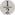     | Yes   | `0.5`       | One-half generic mana              | [Example Cards](https://scryfall.com/search?order=edhrec&q=m%3A%22%7B%C2%BD%7D%22+OR+o%3A%22%7B%C2%BD%7D%22)       |
| `{1}`       |         | Yes   | `1.0`       | One generic mana                   | [Example Cards](https://scryfall.com/search?order=edhrec&q=m%3A%22%7B1%7D%22+OR+o%3A%22%7B1%7D%22)                 |
| `{2}`       |         | Yes   | `2.0`       | Two generic mana                   | [Example Cards](https://scryfall.com/search?order=edhrec&q=m%3A%22%7B2%7D%22+OR+o%3A%22%7B2%7D%22)                 |
| `{3}`       |         | Yes   | `3.0`       | Three generic mana                 | [Example Cards](https://scryfall.com/search?order=edhrec&q=m%3A%22%7B3%7D%22+OR+o%3A%22%7B3%7D%22)                 |
| `{4}`       |         | Yes   | `4.0`       | Four generic mana                  | [Example Cards](https://scryfall.com/search?order=edhrec&q=m%3A%22%7B4%7D%22+OR+o%3A%22%7B4%7D%22)                 |
| `{5}`       | 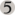        | Yes   | `5.0`       | Five generic mana                  | [Example Cards](https://scryfall.com/search?order=edhrec&q=m%3A%22%7B5%7D%22+OR+o%3A%22%7B5%7D%22)                 |
| `{6}`       |         | Yes   | `6.0`       | Six generic mana                   | [Example Cards](https://scryfall.com/search?order=edhrec&q=m%3A%22%7B6%7D%22+OR+o%3A%22%7B6%7D%22)                 |
| `{7}`       | 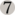        | Yes   | `7.0`       | Seven generic mana                 | [Example Cards](https://scryfall.com/search?order=edhrec&q=m%3A%22%7B7%7D%22+OR+o%3A%22%7B7%7D%22)                 |
| `{8}`       |         | Yes   | `8.0`       | Eight generic mana                 | [Example Cards](https://scryfall.com/search?order=edhrec&q=m%3A%22%7B8%7D%22+OR+o%3A%22%7B8%7D%22)                 |
| `{9}`       |         | Yes   | `9.0`       | Nine generic mana                  | [Example Cards](https://scryfall.com/search?order=edhrec&q=m%3A%22%7B9%7D%22+OR+o%3A%22%7B9%7D%22)                 |
| `{10}`      |        | Yes   | `10.0`      | Ten generic mana                   | [Example Cards](https://scryfall.com/search?order=edhrec&q=m%3A%22%7B10%7D%22+OR+o%3A%22%7B10%7D%22)               |
| `{11}`      |        | Yes   | `11.0`      | Eleven generic mana                | [Example Cards](https://scryfall.com/search?order=edhrec&q=m%3A%22%7B11%7D%22+OR+o%3A%22%7B11%7D%22)               |
| `{12}`      | 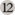       | Yes   | `12.0`      | Twelve generic mana                | [Example Cards](https://scryfall.com/search?order=edhrec&q=m%3A%22%7B12%7D%22+OR+o%3A%22%7B12%7D%22)               |
| `{13}`      | 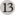       | Yes   | `13.0`      | Thirteen generic mana              | [Example Cards](https://scryfall.com/search?order=edhrec&q=m%3A%22%7B13%7D%22+OR+o%3A%22%7B13%7D%22)               |
| `{14}`      |        | Yes   | `14.0`      | Fourteen generic mana              | [Example Cards](https://scryfall.com/search?order=edhrec&q=m%3A%22%7B14%7D%22+OR+o%3A%22%7B14%7D%22)               |
| `{15}`      |        | Yes   | `15.0`      | Fifteen generic mana               | [Example Cards](https://scryfall.com/search?order=edhrec&q=m%3A%22%7B15%7D%22+OR+o%3A%22%7B15%7D%22)               |
| `{16}`      | 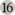       | Yes   | `16.0`      | Sixteen generic mana               | [Example Cards](https://scryfall.com/search?order=edhrec&q=m%3A%22%7B16%7D%22+OR+o%3A%22%7B16%7D%22)               |
| `{17}`      | 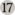       | Yes   | `17.0`      | Seventeen generic mana             | [Example Cards](https://scryfall.com/search?order=edhrec&q=m%3A%22%7B17%7D%22+OR+o%3A%22%7B17%7D%22)               |
| `{18}`      |        | Yes   | `18.0`      | Eighteen generic mana              | [Example Cards](https://scryfall.com/search?order=edhrec&q=m%3A%22%7B18%7D%22+OR+o%3A%22%7B18%7D%22)               |
| `{19}`      | 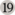       | Yes   | `19.0`      | Nineteen generic mana              | [Example Cards](https://scryfall.com/search?order=edhrec&q=m%3A%22%7B19%7D%22+OR+o%3A%22%7B19%7D%22)               |
| `{20}`      | 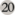       | Yes   | `20.0`      | Twenty generic mana                | [Example Cards](https://scryfall.com/search?order=edhrec&q=m%3A%22%7B20%7D%22+OR+o%3A%22%7B20%7D%22)               |
| `{100}`     | 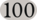      | Yes   | `100.0`     | One hundred generic mana           | [Example Cards](https://scryfall.com/search?order=edhrec&q=m%3A%22%7B100%7D%22+OR+o%3A%22%7B100%7D%22)             |
| `{1000000}` | 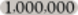  | Yes   | `1000000.0` | One million generic mana           | [Example Cards](https://scryfall.com/search?order=edhrec&q=m%3A%22%7B1000000%7D%22+OR+o%3A%22%7B1000000%7D%22)     |
| `{∞}`       |  | Yes   | `Infinity`  | Infinite generic mana              | [Example Cards](https://scryfall.com/search?order=edhrec&q=m%3A%22%7B%E2%88%9E%7D%22+OR+o%3A%22%7B%E2%88%9E%7D%22) |
| `{W/U}`     |        | Yes   | `1.0`       | One white or blue mana             | [Example Cards](https://scryfall.com/search?order=edhrec&q=m%3A%22%7BW%2FU%7D%22+OR+o%3A%22%7BW%2FU%7D%22)         |
| `{W/B}`     |        | Yes   | `1.0`       | One white or black mana            | [Example Cards](https://scryfall.com/search?order=edhrec&q=m%3A%22%7BW%2FB%7D%22+OR+o%3A%22%7BW%2FB%7D%22)         |
| `{B/R}`     |        | Yes   | `1.0`       | One black or red mana              | [Example Cards](https://scryfall.com/search?order=edhrec&q=m%3A%22%7BB%2FR%7D%22+OR+o%3A%22%7BB%2FR%7D%22)         |
| `{B/G}`     |        | Yes   | `1.0`       | One black or green mana            | [Example Cards](https://scryfall.com/search?order=edhrec&q=m%3A%22%7BB%2FG%7D%22+OR+o%3A%22%7BB%2FG%7D%22)         |
| `{U/B}`     |        | Yes   | `1.0`       | One blue or black mana             | [Example Cards](https://scryfall.com/search?order=edhrec&q=m%3A%22%7BU%2FB%7D%22+OR+o%3A%22%7BU%2FB%7D%22)         |
| `{U/R}`     |        | Yes   | `1.0`       | One blue or red mana               | [Example Cards](https://scryfall.com/search?order=edhrec&q=m%3A%22%7BU%2FR%7D%22+OR+o%3A%22%7BU%2FR%7D%22)         |
| `{R/G}`     |        | Yes   | `1.0`       | One red or green mana              | [Example Cards](https://scryfall.com/search?order=edhrec&q=m%3A%22%7BR%2FG%7D%22+OR+o%3A%22%7BR%2FG%7D%22)         |
| `{R/W}`     |        | Yes   | `1.0`       | One red or white mana              | [Example Cards](https://scryfall.com/search?order=edhrec&q=m%3A%22%7BR%2FW%7D%22+OR+o%3A%22%7BR%2FW%7D%22)         |
| `{G/W}`     |        | Yes   | `1.0`       | One green or white mana            | [Example Cards](https://scryfall.com/search?order=edhrec&q=m%3A%22%7BG%2FW%7D%22+OR+o%3A%22%7BG%2FW%7D%22)         |
| `{G/U}`     |        | Yes   | `1.0`       | One green or blue mana             | [Example Cards](https://scryfall.com/search?order=edhrec&q=m%3A%22%7BG%2FU%7D%22+OR+o%3A%22%7BG%2FU%7D%22)         |
| `{2/W}`     |        | Yes   | `2.0`       | Two generic mana or one white mana | [Example Cards](https://scryfall.com/search?order=edhrec&q=m%3A%22%7B2%2FW%7D%22+OR+o%3A%22%7B2%2FW%7D%22)         |
| `{2/U}`     |        | Yes   | `2.0`       | Two generic mana or one blue mana  | [Example Cards](https://scryfall.com/search?order=edhrec&q=m%3A%22%7B2%2FU%7D%22+OR+o%3A%22%7B2%2FU%7D%22)         |
| `{2/B}`     |        | Yes   | `2.0`       | Two generic mana or one black mana | [Example Cards](https://scryfall.com/search?order=edhrec&q=m%3A%22%7B2%2FB%7D%22+OR+o%3A%22%7B2%2FB%7D%22)         |
| `{2/R}`     |        | Yes   | `2.0`       | Two generic mana or one red mana   | [Example Cards](https://scryfall.com/search?order=edhrec&q=m%3A%22%7B2%2FR%7D%22+OR+o%3A%22%7B2%2FR%7D%22)         |
| `{2/G}`     | 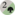       | Yes   | `2.0`       | Two generic mana or one green mana | [Example Cards](https://scryfall.com/search?order=edhrec&q=m%3A%22%7B2%2FG%7D%22+OR+o%3A%22%7B2%2FG%7D%22)         |
| `{P}`       |         | Yes   | `1.0`       | One colored mana or two life       | [Example Cards](https://scryfall.com/search?order=edhrec&q=m%3A%22%7BP%7D%22+OR+o%3A%22%7BP%7D%22)                 |
| `{W/P}`     |        | Yes   | `1.0`       | One white mana or two life         | [Example Cards](https://scryfall.com/search?order=edhrec&q=m%3A%22%7BW%2FP%7D%22+OR+o%3A%22%7BW%2FP%7D%22)         |
| `{U/P}`     |        | Yes   | `1.0`       | One blue mana or two life          | [Example Cards](https://scryfall.com/search?order=edhrec&q=m%3A%22%7BU%2FP%7D%22+OR+o%3A%22%7BU%2FP%7D%22)         |
| `{B/P}`     |        | Yes   | `1.0`       | One black mana or two life         | [Example Cards](https://scryfall.com/search?order=edhrec&q=m%3A%22%7BB%2FP%7D%22+OR+o%3A%22%7BB%2FP%7D%22)         |
| `{R/P}`     |        | Yes   | `1.0`       | One red mana or two life           | [Example Cards](https://scryfall.com/search?order=edhrec&q=m%3A%22%7BR%2FP%7D%22+OR+o%3A%22%7BR%2FP%7D%22)         |
| `{G/P}`     |        | Yes   | `1.0`       | One green mana or two life         | [Example Cards](https://scryfall.com/search?order=edhrec&q=m%3A%22%7BG%2FP%7D%22+OR+o%3A%22%7BG%2FP%7D%22)         |
| `{HW}`      |        | Yes   | `0.5`       | One-half white mana                | [Example Cards](https://scryfall.com/search?order=edhrec&q=m%3A%22%7BHW%7D%22+OR+o%3A%22%7BHW%7D%22)               |
| `{HR}`      |        | Yes   | `0.5`       | One-half red mana                  | [Example Cards](https://scryfall.com/search?order=edhrec&q=m%3A%22%7BHR%7D%22+OR+o%3A%22%7BHR%7D%22)               |
| `{W}`       |         | Yes   | `1.0`       | One white mana                     | [Example Cards](https://scryfall.com/search?order=edhrec&q=m%3A%22%7BW%7D%22+OR+o%3A%22%7BW%7D%22)                 |
| `{U}`       |         | Yes   | `1.0`       | One blue mana                      | [Example Cards](https://scryfall.com/search?order=edhrec&q=m%3A%22%7BU%7D%22+OR+o%3A%22%7BU%7D%22)                 |
| `{B}`       |         | Yes   | `1.0`       | One black mana                     | [Example Cards](https://scryfall.com/search?order=edhrec&q=m%3A%22%7BB%7D%22+OR+o%3A%22%7BB%7D%22)                 |
| `{R}`       |         | Yes   | `1.0`       | One red mana                       | [Example Cards](https://scryfall.com/search?order=edhrec&q=m%3A%22%7BR%7D%22+OR+o%3A%22%7BR%7D%22)                 |
| `{G}`       |         | Yes   | `1.0`       | One green mana                     | [Example Cards](https://scryfall.com/search?order=edhrec&q=m%3A%22%7BG%7D%22+OR+o%3A%22%7BG%7D%22)                 |
| `{C}`       | 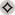        | Yes   | `1.0`       | One colorless mana                 | [Example Cards](https://scryfall.com/search?order=edhrec&q=m%3A%22%7BC%7D%22+OR+o%3A%22%7BC%7D%22)                 |
| `{S}`       |         | Yes   | `1.0`       | One snow mana                      | [Example Cards](https://scryfall.com/search?order=edhrec&q=m%3A%22%7BS%7D%22+OR+o%3A%22%7BS%7D%22)                 |
